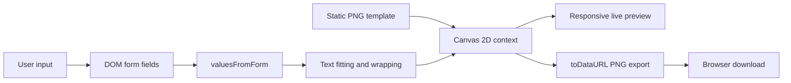
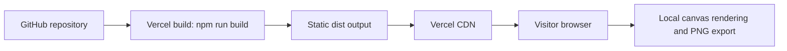

# Toastmasters Flyer Studio: Implementation and Technical Architecture

## 1. Purpose and scope

Toastmasters Flyer Studio is a browser-based tool for adding club and event information to a fixed Toastmasters open-house flyer template. A user enters four values—club name, date, time, and location—and receives an immediate preview that can be downloaded as a 1003 × 1568 PNG.

The application is intentionally client-only. It has no application server, database, user accounts, analytics integration, or upload API. The template image, user interface, text layout, image composition, and PNG export all run in the visitor's browser. This keeps deployment simple and prevents the entered event details from being sent to an application backend.

## 2. Technology stack

| Layer | Technology | Responsibility |
| --- | --- | --- |
| Document shell | HTML5 | Metadata, viewport configuration, application mount point, and JavaScript entry point |
| Application logic | Vanilla JavaScript using ES modules | UI generation, event handling, text fitting, canvas rendering, validation, reset, and download |
| Flyer rendering | Canvas 2D API | Composes the template and personalized text into one raster image |
| Presentation | CSS3 | Layout, colors, responsive behavior, interaction states, loading state, and accessibility preferences |
| Development/build | Vite 7 | Local development server and optimized production build |
| Package management | npm | Locks and installs the Vite development dependency |
| Hosting | Vercel-compatible static hosting | Runs the Vite build and serves the generated `dist` directory |

There are no runtime JavaScript dependencies. Vite is used only during development and build.

## 3. Repository structure

```text
EditableFlyerOpenHouse/
├── index.html
├── package.json
├── package-lock.json
├── vercel.json
├── public/
│   └── toastmasters-open-house-template.png
├── src/
│   ├── main.js
│   └── styles.css
└── docs/
    └── TECHNICAL_ARCHITECTURE.md
```

- `index.html` is the Vite entry document. It provides SEO/browser metadata, an empty `#app` mount element, and loads `/src/main.js` as an ES module.
- `src/main.js` contains the entire application behavior and dynamically builds the page markup.
- `src/styles.css` defines the visual design and responsive layout.
- `public/toastmasters-open-house-template.png` is copied unchanged to the root of the production build and used as the canvas background.
- `vercel.json` tells Vercel to run `npm run build` and publish `dist`.
- `dist` and `node_modules` are generated locally and excluded from version control.

## 4. High-level architecture



The DOM form is the source of truth for current user input. There is no separate state-management layer. Every input event reads the form values and redraws the canvas. This is appropriate for the current four-field interface and keeps state synchronization straightforward.

The visible canvas and the exported image are the same canvas element. CSS scales it to fit the preview panel, while its intrinsic pixel dimensions remain fixed at 1003 × 1568. Consequently, the downloaded file retains the full configured resolution regardless of the screen size used to edit it.

## 5. Application initialization

`src/main.js` starts by importing the stylesheet and defining three central configuration groups:

1. `TEMPLATE_URL`, `FLYER_WIDTH`, and `FLYER_HEIGHT` define the template path and output dimensions.
2. `initialValues` supplies the form's initial example content and the reset target.
3. `fields` defines each editable field's ID, label, maximum length, hint, and placeholder.

The application then assigns a complete UI template to `document.querySelector('#app').innerHTML`. The generated markup includes:

- a header and introductory section;
- the event details form;
- character counters and field guidance;
- download and reset controls;
- a live-preview panel containing the canvas;
- loading and error states for the template image;
- a non-blocking download confirmation toast; and
- semantic and accessibility attributes such as labels, `aria-describedby`, `aria-live`, and an accessible canvas description.

After the markup is mounted, the code caches references to the canvas, its 2D rendering context, the form, and the loading indicator. It also creates an `Image` object for loading the flyer template.

## 6. Runtime data flow

### 6.1 Template loading

The template is requested from `/toastmasters-open-house-template.png`. Vite serves files in `public` from the site root in both development and production.

While the image loads, the canvas is transparent and a preparation message is shown. The image's `load` event sets `templateReady`, hides the loading state, fades in the canvas, and triggers the first render. If loading fails, the UI replaces the spinner with an error message and does not attempt an export.

The `templateReady` guard prevents drawing or downloading an incomplete flyer.

### 6.2 Form input

Each field has a native `maxlength` constraint and is required. On every `input` event, the application:

1. updates the field's current-length counter;
2. highlights the counter after it reaches 85% of the maximum; and
3. calls `renderFlyer()` to update the preview.

`valuesFromForm()` reads the current values directly from the DOM and trims leading and trailing whitespace. This means the preview always reflects the fields as displayed, without maintaining duplicate application state.

### 6.3 Canvas render pipeline

Every completed render follows the same deterministic sequence:

1. Clear all 1003 × 1568 pixels with `clearRect`.
2. Draw the original template across the complete canvas.
3. Draw the club name in the central name area.
4. Draw the date, time, and location in their configured detail areas.

Canvas state changes are enclosed in `save()` and `restore()` calls. This prevents properties such as alignment, color, font, stroke, and shadow from leaking from one drawing operation into another.

## 7. Text wrapping and automatic fitting

Text fitting is handled by two reusable functions.

### 7.1 `wrapAtCurrentSize(content, maxWidth)`

This function assumes the canvas context already has the intended font. It splits content on whitespace and builds lines word by word, using `ctx.measureText()` to test each candidate line against the allowed width.

If a single word is wider than the available area, the function falls back to character-level splitting. This prevents unusually long unbroken input from overflowing the flyer.

### 7.2 `fitLines(...)`

`fitLines` repeatedly calls the wrapping function while decreasing the font size one pixel at a time. It begins at the configured preferred size and returns as soon as the wrapped content fits within the permitted number of lines.

If the content still does not fit at the hard minimum size, the function:

1. keeps only the permitted number of lines;
2. shortens the last visible line one character at a time; and
3. appends an ellipsis that fits within the width.

The effective hard minimum is `min(12, configuredMinFontSize)`, so the algorithm can shrink below the normal design minimum as a final overflow defense. In normal use, field-level character limits make this fallback uncommon.

### 7.3 Flyer placement rules

All personalized content is converted to uppercase before it is drawn.

| Element | Horizontal placement | Vertical center | Width | Lines | Preferred size | Design minimum |
| --- | --- | ---: | ---: | ---: | ---: | ---: |
| Club name | Centered at canvas midpoint | 546 px | 770 px | 3 | 66 px | 34 px |
| Date | Starts at x = 444 px | 797 px | 455 px | 2 | 32 px | 22 px |
| Time | Starts at x = 444 px | 943 px | 455 px | 2 | 34 px | 23 px |
| Location | Starts at x = 480 px | 1088 px | 420 px | 2 | 31 px | 21 px |

The club name uses centered alignment, a light shadow for contrast against the template, and a decorative gold line with a red center point. Detail fields use left alignment. Each text block is vertically centered around its configured `centerY`, based on its calculated font size, line height, and line count.

The coordinates are template-specific. Replacing the background with artwork that has different safe areas requires recalibrating these placement values.

## 8. PNG download behavior

The Download PNG button submits the form. Its handler prevents page navigation and calls native form validation through `reportValidity()`. If the fields are valid and the template is ready, the application performs one final render and then:

1. converts the canvas to a PNG data URL using `canvas.toDataURL('image/png')`;
2. creates a temporary anchor element;
3. assigns the data URL to the anchor's `href`;
4. creates a filename from the club name; and
5. programmatically clicks the anchor to invoke the browser download.

The filename is normalized to lowercase ASCII letters and numbers separated by hyphens. If normalization produces an empty name, the fallback is `toastmasters-club-open-house.png`.

After the download starts, an `aria-live` toast is displayed for 2.8 seconds. No file is uploaded to a server during this process.

## 9. Reset behavior

Reset restores each input from `initialValues`, refreshes every counter, redraws the canvas, and returns keyboard focus to the club-name field. It uses a button with `type="button"`, so it does not invoke form submission or browser-native reset behavior.

## 10. Responsive and accessible presentation

The CSS uses a two-column workspace on large screens, with a sticky editing panel and a flexible preview. At 800 pixels or below, the preview moves above the editor and both occupy a single column. Additional adjustments at 480 pixels optimize spacing, typography, buttons, and metadata for narrow screens.

The canvas keeps its intrinsic dimensions but uses `width: 100%` and `height: auto`, preserving its aspect ratio while scaling visually.

Accessibility-related implementation includes:

- associated labels and hints for all inputs;
- native required-field and maximum-length behavior;
- a visible keyboard focus state;
- status announcements via `role="status"` and `aria-live="polite"`;
- meaningful section headings and landmarks;
- decorative content hidden from assistive technology; and
- a `prefers-reduced-motion` rule that effectively disables animations and transitions.

The canvas has an accessible label, but the personalized flyer itself is raster content. If the generated image is distributed on the web, accompanying text or alt text should be provided by the publishing platform.

## 11. Build and deployment architecture

### Local development

```bash
npm install
npm run dev
```

Vite serves the source with fast module loading and development-time updates.

### Production build

```bash
npm run build
```

Vite processes `index.html`, bundles and minifies the JavaScript and CSS, fingerprints generated assets, and writes the static site to `dist`. The PNG from `public` is copied to the distribution root without being bundled into JavaScript.

### Vercel deployment

`vercel.json` declares Vite as the framework, `npm run build` as the build command, and `dist` as the output directory. The deployed system is therefore a static-site architecture:



There are no serverless functions or backend routes. A generic static host can deploy the same `dist` output if it preserves the site's root-relative asset paths.

## 12. Privacy and security characteristics

- Event values remain in the page's DOM and in browser memory.
- Flyer composition and export happen locally through the Canvas API.
- No storage, cookies, authentication tokens, or application API calls are implemented.
- The application does not persist data across refreshes.
- User input is read from input values and passed to `fillText`; it is not inserted into the page as executable HTML.
- The fixed, same-origin template avoids cross-origin canvas restrictions. Loading the template from an external origin without correct CORS headers could taint the canvas and prevent `toDataURL()` export.

Static hosting should still use normal platform protections such as HTTPS and appropriate security headers. If analytics, remote templates, or saved projects are added later, the current statement that no event data leaves the browser must be revisited.

## 13. Current limitations and design tradeoffs

- The template and drawing coordinates are tightly coupled. There is no generic template schema.
- The project uses fallback system fonts rather than bundled web fonts, so exact glyph metrics can vary slightly by operating system and browser.
- The Canvas 2D text algorithm is optimized for whitespace-delimited languages and does not implement advanced shaping, hyphenation, or bidirectional layout.
- PNG export uses a data URL, which is simple at this image size but consumes more temporary memory than a Blob-based export.
- The user cannot reposition, restyle, or resize individual fields manually.
- There is no automated test suite; current verification relies on the Vite production build and manual browser checks.
- The output has fixed pixel dimensions but does not embed a print DPI requirement. Print size and quality depend on the target workflow.

These are reasonable tradeoffs for a focused, single-template tool. If the application expands to multiple templates or user-controlled layouts, the rendering configuration should move from hard-coded functions into a validated template schema.

## 14. Recommended extension points

### Add or change a field

Update `initialValues` and `fields`, then add its drawing call in `renderFlyer()`. If the field has a new visual region, define its width, vertical center, line limit, and font-size bounds against the template's pixel coordinate system.

### Support multiple templates

Introduce a template configuration object containing:

- asset URL and intrinsic dimensions;
- field definitions and limits;
- placement, alignment, color, and typography rules; and
- optional decorative drawing instructions.

The selected configuration can then drive both form generation and rendering.

### Improve font consistency

Bundle licensed web fonts, wait for `document.fonts.ready`, and render only after the required faces are loaded. This would make `measureText()` and output layout more consistent across platforms.

### Add project persistence

For browser-only persistence, store field values in `localStorage` with a clear reset/delete option. Cross-device saved projects would require a backend, identity model, data-retention policy, and updated privacy messaging.

### Improve export scalability

Use `canvas.toBlob()` with `URL.createObjectURL()` for more memory-efficient downloads, especially if future templates use substantially larger canvases.

## 15. Verification checklist

Before deployment, verify the following:

1. Run `npm run build` successfully.
2. Open the production preview with `npm run preview`.
3. Confirm the template loads without console or network errors.
4. Test empty required fields and maximum-length values.
5. Test long words to confirm wrapping and ellipsis behavior.
6. Download a flyer and confirm its dimensions are exactly 1003 × 1568 pixels.
7. Compare preview and downloaded text placement.
8. Test desktop and mobile layouts, keyboard navigation, and reduced-motion mode.
9. Confirm no event details are transmitted in the browser's network panel.

## 16. Summary

Toastmasters Flyer Studio uses a compact static-web architecture. The DOM collects event data, a deterministic Canvas 2D pipeline composites that data over a fixed template, and the browser exports the result directly as PNG. Vite packages the application for static hosting, while Vercel serves the resulting files. The absence of a backend minimizes operational complexity and supports the application's central privacy property: personalization stays in the visitor's browser.
