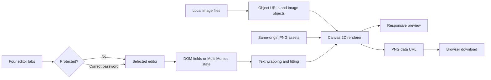
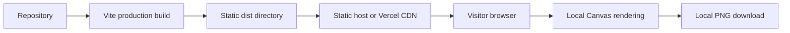

# Toastmasters Flyer Studio: Technical Architecture

## 1. Purpose and scope

Toastmasters Flyer Studio is a static browser application for producing four personalized Toastmasters assets:

- an Open House flyer;
- a single-participant Testimonials graphic;
- a Certificate of Appreciation; and
- a Multi Monies U.S. Letter composition containing one to eight participant stories.

The application has no backend, database, upload API, analytics integration, or user-account system. Forms, uploaded portraits, canvas composition, and PNG export remain in the visitor's browser. Refreshing the page clears edited values, uploaded images, and password-unlock state.

## 2. Technology stack

| Layer | Technology | Responsibility |
| --- | --- | --- |
| Document shell | HTML5 | Metadata, viewport configuration, application mount point |
| Application | Vanilla JavaScript ES modules | Markup generation, state, events, validation, password gates, rendering, export |
| Graphics | Canvas 2D API | Template compositing, vector decoration, image cropping, text fitting |
| Presentation | CSS3 | Responsive layout, tabs, forms, accordions, modal, loading and focus states |
| Development | Vite 7 | Development server and optimized static build |
| Hosting | Vercel-compatible static hosting | Serves the generated `dist` directory |

There are no runtime JavaScript packages. Vite is the only development dependency.

## 3. Repository structure

```text
EditableFlyerOpenHouse/
├── index.html
├── package.json
├── package-lock.json
├── vercel.json
├── public/
│   ├── toastmasters-open-house-template.png
│   ├── toastmasters-international-logo.png
│   └── toastimonies-certificate-template.png
├── src/
│   ├── main.js
│   └── styles.css
└── docs/
    └── TECHNICAL_ARCHITECTURE.md
```

- `src/main.js` generates the interface and contains all render and interaction logic.
- `src/styles.css` contains the responsive application design.
- `public/toastmasters-open-house-template.png` is the fixed Open House background.
- `public/toastmasters-international-logo.png` is the supplied transparent official logo used by Testimonials and Multi Monies.
- `public/toastimonies-certificate-template.png` is the supplied certificate, including both original signatures.

## 4. Editor and output matrix

| Tab | Canvas | Editable data | Access |
| --- | ---: | --- | --- |
| Open House (`01`) | 1003 × 1568 | Club, date, time, location | Open |
| Testimonials (`02`) | 1254 × 1254 | Portrait, zoom, testimonial, name, designation | `aurie26retention` |
| Certificates (`03`) | 1463 × 1075 | Participant name only | `aurie26retention` |
| Multi Monies (`04`) | 2550 × 3300 | Count plus portrait, zoom, testimonial, name, and designation per participant | `chrismonies` |

Testimonials and Certificates share an unlock group. Entering `aurie26retention` in either gate unlocks both for the current page lifetime. Multi Monies is independently unlocked with `chrismonies`.

## 5. High-level data flow



The Open House, Testimonials, and Certificate editors read current values from DOM controls. Multi Monies maintains an eight-entry in-memory array because its visible controls are rebuilt when the selected bubble count changes.

## 6. Initialization and navigation

`main.js` writes the complete application markup into `#app`, then caches all canvas contexts and creates `Image` objects for static assets. Each tab uses `role="tab"`; each view uses `role="tabpanel"`. Mouse clicks and Left/Right arrow keys route through `requestFlyer()`.

`switchFlyer()` performs three operations:

1. updates active-tab classes, `aria-selected`, and keyboard tab stops;
2. shows only the matching panel; and
3. redraws the selected canvas.

The number badges are identifiers rather than workflow-step numbers: both panels in a view display that view's tab number.

## 7. Password-gate behavior

Protected tabs open an accessible modal dialog before their panel is shown. The dialog supports Submit, Cancel, backdrop dismissal, and Escape. Incorrect values display inline feedback and retain focus in the password field.

Unlock state is held in the in-memory `unlockedProtectedFlyers` set. It is not written to cookies, local storage, or session storage and therefore resets on refresh.

### Security limitation

The passwords are constants in client-delivered JavaScript. Minification does not make them secret. This mechanism deters casual access but is not authentication. Real access control requires server-side verification, protected routes/assets, and an authenticated session.

## 8. Text measurement and fitting

### `wrapText(ctx, content, maxWidth)`

The wrapper uses `measureText()` to assemble whitespace-delimited lines. Words wider than the available width are split at character boundaries to prevent horizontal overflow.

### `fitLines(...)`

This routine decreases the font size until text fits a configured width and line count. If the configured hard minimum is reached, it limits the output and appends an ellipsis. It is used for compact metadata such as names, roles, and Open House details.

### `fitCompleteTextBlock(...)`

Testimonials must not be truncated. This routine decreases font size until every wrapped line fits a specified width and height. It never adds an ellipsis. It is used for:

- the 220-character Testimonials message; and
- every 260-character Multi Monies participant message.

The available text height ends above the gold divider, preserving separation from attribution content.

## 9. Open House renderer

The Open House canvas draws the supplied 1003 × 1568 template first, then overlays four fields:

| Field | Width | Lines | Preferred size | Normal minimum |
| --- | ---: | ---: | ---: | ---: |
| Club | 770 px | 3 | 66 px | 34 px |
| Date | 455 px | 2 | 32 px | 22 px |
| Time | 455 px | 2 | 34 px | 23 px |
| Location | 420 px | 2 | 31 px | 21 px |

The club name is centered; the remaining fields are left-aligned in template-specific safe areas.

## 10. Testimonials renderer

Testimonials is a square 1254 × 1254 composition. Its vector background, speech card, participant photo frame, quote marks, text, attribution, district footer, and logo lockup are redrawn on every input event.

The application uses the free Toastmasters typography alternatives across every editable or vector-rendered text layer: self-hosted Montserrat for headings and names, and self-hosted Source Sans 3 for body copy and supporting details. Source Sans 3 is the maintained open-source successor to Source Sans Pro. Both variable TrueType files and their SIL Open Font License texts live under `public/fonts/`. Every download handler waits for both font faces before its final render, preventing a fallback-font PNG if a user exports during initial font loading. Text baked into the supplied Open House and Certificate PNG templates cannot change without reconstructing those source images; only their editable overlays use the new font system.

The participant portrait is loaded through a temporary object URL, centre-cropped to a square, clipped to a circle, and scaled using the zoom slider. Removing or replacing a portrait revokes the previous object URL.

The layout supports:

- a 220-character complete testimonial;
- a name of up to 45 characters across at most two lines;
- a designation of up to 65 characters across at most two lines; and
- dynamic spacing between the name and designation.

Only brand color constants and the `MONIES` title highlight were changed when the official palette was applied; the established layout and behavior remain unchanged.

## 11. Certificate renderer

The certificate uses the supplied 1463 × 1075 PNG as its complete background. This preserves borders, logos, wording, names, and signatures exactly as supplied.

To personalize it, the renderer:

1. draws the full source image;
2. stretches a clean strip of the source paper texture over only the placeholder-name area; and
3. centers the uppercase participant name in that cleared region.

No signature coordinates are painted over or reconstructed. The only editable value is the recipient name, limited to 50 characters.

## 12. Multi Monies renderer

Multi Monies exports a 2550 × 3300 portrait PNG. Those dimensions have the 8.5 × 11 U.S. Letter aspect ratio at 300 pixels per inch. The application tab is called Multi Monies, but the artwork heading remains `TOASTIMONIES` to match the single-participant output.

Both branded story outputs keep `MONIES` in True Maroon and add a proportional Happy Yellow canvas stroke plus a low-opacity yellow blur. Testimonials uses a 3 px stroke and 10 px blur; Multi Monies uses a 5 px stroke and 18 px blur for its larger canvas.

### Dynamic participant editors

The count selector accepts values from 1 through 8. `renderMultiEditors()` creates one collapsible editor per selected participant. Each editor contains:

- required PNG, JPEG, or WebP portrait upload;
- portrait zoom from 100% to 190%;
- testimonial text limited to 260 characters;
- participant name limited to 45 characters; and
- designation limited to 65 characters.

Reducing the visible count does not immediately destroy higher-index participant state. Increasing it again restores those entries. Reset revokes all image URLs and returns to two default bubbles.

### Bubble layout

- One or two bubbles use one full-width column.
- Three through eight bubbles use two columns.
- Row count is calculated with `ceil(count / columns)`.
- Card height is derived from the fixed content region after subtracting row gaps.
- An unpaired bubble in an odd final row is centered.

Each bubble reproduces the Testimonials visual language: white speech shape, attached circular portrait, maroon quotation marks, complete fitted comment, Happy Yellow divider, Loyal Blue participant name, and role.

The eight positions deliberately use eight different silhouettes. `drawMultiBubbleShape()` maps each zero-based participant index to a rounded speech bubble, oval, thought cloud, comic burst, side-tail card, shield bubble, angular chat bubble, or organic blob. The mapping is stable as count changes, so no active position duplicates another. Shape-specific horizontal and vertical safe-area ratios keep all content inside irregular edges. Testimonial lines, divider, name, and role are center-aligned; the complete testimonial block is vertically centered above the divider. The opening and closing maroon quotation marks are positioned from the measured widths and baselines of the first and last rendered testimonial lines, keeping both marks inside the safe text area. Portrait placement alternates or moves to the outside edge of two-column layouts.

Speech tails are painted first and overlapped by their parent bubble body so the shared seam disappears, while thought-cloud dots begin at the cloud edge and remain grouped tightly. One-column and two-column layouts use enlarged horizontal margins so the rotated bubble, portrait border, and visible artwork retain at least a small print-safe inset from both canvas edges.

Every entry receives a random tilt between approximately 0.45 and 1.3 degrees in either direction. The angle is created with the entry, remains stable across input renders and count changes, and is regenerated on reset. The bubble shape, portrait, and content share one canvas rotation around the card center, preserving their visual association while avoiding layout jitter.

### Portrait lifecycle

Each entry owns its `Image`, object URL, filename, and zoom value. Replacement and removal revoke the prior object URL. All portrait processing remains local. Before export, the form checks every active entry and blocks the download if a portrait is missing; it opens and scrolls to the first incomplete participant editor.

## 13. Official brand palette

Testimonials and Multi Monies use the official colors documented in the [Toastmasters International Brand Manual](https://content.toastmasters.org/image/upload/02330-001-0001-brand-manual.pdf):

| Name | Hex | RGB | Usage |
| --- | --- | --- | --- |
| Loyal Blue | `#004165` | 0, 65, 101 | Main background and participant names |
| True Maroon | `#772432` | 119, 36, 50 | Lower background, headings, quotation marks |
| Cool Gray | `#A9B2B1` | 169, 178, 177 | Subtle dot texture and neutral accents |
| Happy Yellow | `#F2DF74` | 242, 223, 116 | Dividers, outlines, and highlighted footer text |

White and near-black remain supporting text and card colors.

## 14. PNG export

Each form performs native validation, triggers one final render, converts its canvas using `toDataURL('image/png')`, and programmatically clicks a temporary download link.

| Output | Filename pattern |
| --- | --- |
| Open House | `{club}-open-house.png` |
| Testimonials | `{participant}-testimonial.png` |
| Certificate | `{participant}-toastimonies-certificate.png` |
| Multi Monies | `multi-monies-us-letter.png` |

The visible preview is CSS-scaled, but the downloaded PNG retains the canvas's intrinsic dimensions.

Canvas PNG output does not explicitly include physical DPI metadata. For a physical U.S. Letter print, configure print or layout software to 8.5 × 11 inches; 2550 × 3300 pixels then corresponds to 300 PPI.

## 15. Responsive and accessible behavior

Large screens use a two-column editor/preview workspace. At 800 px and below, the preview moves above the form. Four tabs use a responsive grid that changes from four columns to two on narrow screens.

Accessibility support includes:

- labeled inputs, hints, counters, and native limits;
- keyboard-operated tabs;
- semantic `details` accordions for Multi Monies participants;
- accessible modal semantics and focus handling;
- `aria-live` status/error messages;
- visible focus styles; and
- reduced-motion support.

Canvas output is raster content. Publishing platforms should provide equivalent alt text alongside downloaded graphics.

## 16. Privacy characteristics

- Form values remain in DOM or JavaScript memory.
- Portraits remain local and use browser object URLs.
- Rendering and export are local Canvas operations.
- No user content is transmitted, persisted, or logged by the application.
- Same-origin assets keep canvases exportable; cross-origin images without appropriate CORS headers would taint a canvas.

## 17. Build and deployment

```bash
npm install
npm run dev
npm run build
npm run preview
```

Vite writes the optimized site to `dist`. Files in `public` are copied to the distribution root. `vercel.json` configures Vercel to run the build and serve `dist`; no serverless function is required.



## 18. Current limitations

- Canvas coordinates are template-specific and not driven by a general template schema.
- Hardcoded client-side passwords are discoverable and provide no real authorization boundary.
- If either self-hosted brand font fails to load, the configured system fallback can have slightly different metrics across browsers and operating systems.
- Portrait cropping is centered; users can zoom but cannot independently pan horizontally or vertically.
- Export uses data URLs, which consume more temporary memory than Blob-based export—especially for the 2550 × 3300 canvas.
- PNG files have exact pixel dimensions but no guaranteed embedded DPI metadata.
- There is no automated browser test suite; validation uses syntax checks, production builds, and manual visual review.

## 19. Verification checklist

Before deployment:

1. Run `node --check src/main.js`.
2. Run `npm run build`.
3. Confirm all three PNG assets load from the production preview.
4. Verify tab identifiers `01` through `04` in both editor and preview headings.
5. Test valid and invalid values for both password groups.
6. Verify Testimonials displays all 220 characters without an ellipsis.
7. Test Multi Monies counts 1 through 8 and confirm the same number of editor accordions and canvas bubbles.
8. Enter 260 characters in every visible Multi Monies comment and confirm complete rendering.
9. Confirm Multi Monies blocks export until all selected participants have portraits; then upload, zoom, replace, and remove portraits in several entries.
10. Select eight participants and confirm all eight bubble silhouettes are visibly different and the artwork heading reads `TOASTIMONIES`.
11. Confirm long comments remain horizontally and vertically centered within every irregular bubble at all counts, then reset and verify that subtle tilt angles change without causing collisions.
12. Download every output and verify intrinsic dimensions.
13. Confirm certificate signatures match the supplied template pixel-for-pixel outside the participant-name replacement region.
14. Test desktop, tablet, mobile, keyboard navigation, and reduced-motion behavior.
15. Confirm the browser network panel sends no form or portrait data.
16. Confirm Montserrat renders all editable headings and names, Source Sans 3 renders editable body/details, and all four downloads retain those fonts after a cold page load.

## 20. Extension guidance

If more templates are added, move field definitions, output dimensions, placement rules, passwords, and asset URLs into validated configuration objects. If true access control becomes necessary, place protected functionality and assets behind server-side authentication. If canvas sizes grow further, replace `toDataURL()` with `toBlob()` and object URLs to reduce memory pressure.
